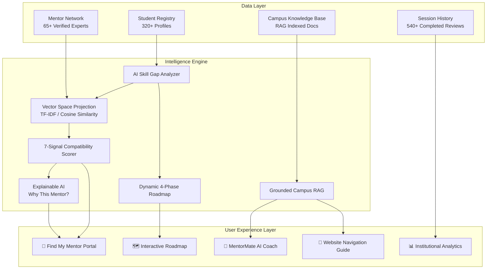

<div align="center">

# 🎓 MentorMatch AI

### *"Find the right mentor. Build the right future."*

**AI-Powered Mentorship Intelligence Engine for Every Student's Career Journey**

[](https://www.python.org/)
[](https://streamlit.io/)
[](https://scikit-learn.org/)
[](https://github.com/Techy-hub45/MentorMatch.AI)
[](https://opencv.org/)
[](LICENSE)

---

### 🏆 The Winning Product Philosophy
> *"MentorMatch AI doesn't simply find a mentor. It understands where a student is, where they want to go, what is stopping them, and who can help them get there."*

</div>

---

## 📑 Table of Contents
- [📌 The Problem](#-the-problem)
- [💡 The Solution: AI Mentorship Intelligence](#-the-solution-ai-mentorship-intelligence)
- [✨ Key Features](#-key-features)
- [🏗️ System Architecture & Intelligence Pipeline](#️-system-architecture--intelligence-pipeline)
- [🎯 7-Signal Matching Algorithm](#-7-signal-matching-algorithm)
- [🎨 Editorial Design System & Dual Themes](#-editorial-design-system--dual-themes)
- [⚡ Technology Stack](#-technology-stack)
- [📁 Project Directory Structure](#-project-directory-structure)
- [🎬 3-Minute Hackathon Demo Script](#-3-minute-hackathon-demo-script)
- [🚀 Quickstart & Installation](#-quickstart--installation)
- [🧪 Automated Test Suite](#-automated-test-suite)
- [🔮 Future Roadmap](#-future-roadmap)
- [👥 Contributing & License](#-contributing--license)

---

## 📌 The Problem

Universities across the globe host thousands of motivated students with diverse career ambitions, technical skillsets, and academic trajectories. Simultaneously, institutions possess rich alumni circles, senior students, research faculty, and industry professionals eager to mentor.

Yet, traditional university mentorship remains broken:
* **🎲 Random & Ad-Hoc**: Pairings rely on personal connections, luck, or static club spreadsheets.
* **🙈 Non-Personalized**: Ignores specific skill deficits, practical project bottlenecks, and individual learning styles.
* **📉 Untracked & Opaque**: Zero institutional visibility into career readiness, session quality, or skill uplift.
* **🗺️ Directionless**: Students don't know *what* exact industry skills they lack, *who* is best qualified to mentor them, or *how* to execute a structured curriculum.

---

## 💡 The Solution: AI Mentorship Intelligence

**MentorMatch AI** transforms random networking into a deterministic, closed-loop career acceleration platform:

1. **📊 Multidimensional Profile Telemetry**: Continuously evaluates 12+ student and mentor signals (technical proficiencies, target industry roles, learning styles, availability, and academic track record).
2. **🔍 AI Skill Gap Diagnostics**: Real-time benchmarking against top industry roles (AI Engineer, Full Stack, Data Scientist, Cloud Architect) to pinpoint actionable deficits.
3. **🎯 7-Signal Explainable AI (XAI) Matcher**: Computes transparent compatibility scores with granular reasoning for each recommendation.
4. **🗺️ Dynamic 4-Phase Roadmaps**: Auto-generates structured milestones, weekly discussion agendas, and hands-on capstone deliverables.
5. **🧠 Grounded Campus RAG & MentorMate AI Coach**: Combines local LLM capabilities (Ollama / LM Studio) with a verified Campus Knowledge Base and deterministic offline fallbacks.
6. **🤖 Interactive Website Navigation Guide**: Floating circular chatbot assistant in the bottom-right corner offering 1-click interactive tours of platform features.
7. **📷 Biometric Face & Student ID Verification**: Built-in OpenCV facial detection and university ID OCR anchor to guarantee verified campus student access.
8. **📈 Institutional University Analytics**: Real-time intelligence dashboards, department skill heatmaps, and demand trends for deans and placement officers.

---

## ✨ Key Features

### 1. 🎯 7-Signal AI Matcher & Explainable AI (XAI)
* Evaluates 65+ mentors against student profiles across 7 weighted dimensions.
* Generates a **Top 3 Mentor Recommendations** leaderboard with transparent breakdown bars and verified match criteria.
* Auto-drafts personalized outreach messages for students to send in 1 click.

### 2. 🔍 Diagnostic Skill Gap Analyzer
* Visualizes current proficiency vs. industry expectations via interactive **Radar Charts** and **Horizontal Comparison Bars**.
* Highlights critical bottlenecks (e.g. *Docker & AWS deployment deficits* holding back an aspiring AI Engineer).
* Provides automated remedial actions and targeted learning materials.

### 3. 🗺️ Dynamic 4-Phase Career Roadmap
* Tailors a progressive 4-phase curriculum:
  - **Phase 1: Foundations & Core Architecture**
  - **Phase 2: Applied Tooling & Frameworks**
  - **Phase 3: Production Engineering & Cloud Deployment**
  - **Phase 4: Capstone Portfolio & System Design Mastery**
* Includes structured discussion agendas for 1:1 mentor sessions.

### 4. 🧠 Grounded Campus RAG & AI Career Coach
* Retrieval-Augmented Generation (RAG) backed by university curriculum syllabi, verified placement data, and mentor expertise.
* Resilient multi-tier LLM architecture:
  - **Tier 1**: Local Ollama (`llama3.2`, `llama3.1`, `qwen2.5`)
  - **Tier 2**: LM Studio OpenAI-compatible local server
  - **Tier 3**: Zero-latency deterministic heuristic intelligence (100% offline ready)

### 5. 🤖 Website Navigation Guide Chatbot
* Sleek circular floating widget in the bottom-right corner with smooth entrance animations.
* Interactive 1-click guided tour shortcuts:
  - *"🎯 How do I find the best mentor?"*
  - *"🔍 Explain my Skill Gap report"*
  - *"🗺️ What is the 4-Phase Roadmap?"*
  - *"📅 How do 1:1 sessions work?"*

### 6. 📷 Campus Biometric Verification
* OpenCV-powered facial detection and student ID anchor verification.
* Verifies student identity against the university registrar before granting mentorship booking rights.

### 7. 👤 Student Persona Management & Registration
* Switch between pre-loaded student benchmarks (e.g., Sanath Sharma, 5th Sem CSE) or create and register new student profiles.
* Instant session state persistence and real-time metric recalculation.

### 8. 📊 Institutional Analytics & Campus Heatmaps
* Department enrollment distribution and career target donut charts.
* Campus-wide technical skill heatmap across university engineering departments.
* Algorithmic institutional intelligence insights for academic leadership.

---

## 🏗️ System Architecture & Intelligence Pipeline



---

## 🎯 7-Signal Matching Algorithm

The compatibility score is calculated using normalized vector projections across 7 weighted dimensions:

| Signal Component | Weight | Metric Description |
| :--- | :---: | :--- |
| **Skill Overlap** | **30%** | Semantic & n-gram overlap between student targets and mentor expertise |
| **Career Goal Alignment** | **25%** | Vector similarity between student target role and mentor industry track |
| **Experience Relevance** | **15%** | Tiered seniority matching matched to the student's current semester |
| **Availability Match** | **10%** | Calendar time-slot alignment (Weekends, Evenings, Weekday slots) |
| **Learning Style Compatibility** | **10%** | Hands-on coding vs. conceptual vs. pair-programming synergy |
| **Communication Cadence** | **5%** | Sync weekly check-in vs. async Slack/milestone review preference |
| **Mentor Success Track Record** | **5%** | Historical feedback ratings and completion rates from 540+ sessions |
| **Total Compatibility Score** | **100%** | **Normalized, Explainable Compatibility Index** |

---

## 🎨 Editorial Design System & Dual Themes

MentorMatch AI incorporates a Squarespace-inspired editorial aesthetic:

* **🌙 Obsidian Black Dark Theme**:
  - Deep obsidian canvas (`#09090b`) with pure, crisp white typography (`#ffffff`).
  - Action buttons featuring fiery red-to-yellow gradient styling (`#dc2626` → `#ea580c` → `#eab308`) with golden border highlights.
  - Bespoke pulsing neural squircle brand emblem with dynamic CSS glow.
* **☀️ High-Contrast Light Theme**:
  - Architectural gallery white background (`#fcfcfd`) with rich obsidian black text (`#09090b` / `#18181b`).
  - Minimalist monoline pill buttons and crisp borders.
* **Smooth Micro-Animations**:
  - 60fps card elevation hover effects, responsive metric counters, and floating bottom-right chatbot widget.

---

## ⚡ Technology Stack

| Layer | Technologies Used |
| :--- | :--- |
| **Frontend & UI** | [Streamlit](https://streamlit.io/), Custom Vanilla CSS3 Design System, Google Fonts (*Syne*, *Plus Jakarta Sans*, *JetBrains Mono*) |
| **Visualizations** | [Plotly Express](https://plotly.com/python/), [Plotly Graph Objects](https://plotly.com/python/graph-objects/) (Radar, Bar, Heatmap, Donut) |
| **Language & Core** | Python 3.10+ / 3.11 / 3.12 / 3.14 |
| **Database** | SQLite3 (`database/mentormatch.db`) with relational schema & query helpers |
| **AI / Vector Engine** | Scikit-Learn TF-IDF N-Gram Sparse Embedding Space with Cosine Vector Distance |
| **RAG & LLM Engine** | Multi-Tier Architecture: Local Ollama / LM Studio Server / Fallback Heuristic Intelligence |
| **Computer Vision** | [OpenCV](https://opencv.org/) (`cv2`) Haar-Cascade Facial Detection & Student ID OCR Anchor |
| **Automation & QA** | Automated verification test suite (`test_app.py`) covering all 6 core sub-systems |

---

## 📁 Project Directory Structure

```text
MentorMatch.AI/
├── app.py                      # Main Streamlit Application & Multi-Page Controller
├── requirements.txt            # Production Python Dependencies
├── README.md                   # Comprehensive Architectural Documentation
├── run.bat                     # 1-Click Windows Application Launcher
├── setup.bat                   # 1-Click Environment Setup Script
├── test_app.py                 # Automated Test Suite (All 6 AI sub-systems)
├── .gitignore                  # Git Ignore Rules
│
├── ai/                         # AI & Intelligence Core
│   ├── embeddings.py           # Vector Space Embeddings & Cosine Similarity
│   ├── matcher.py              # 7-Signal Matching & Explainable AI Generator
│   ├── rag.py                  # Grounded Campus RAG & Website Guide Chatbot
│   ├── roadmap.py              # Dynamic 4-Phase Milestone Generator
│   ├── skill_gap.py            # Industry Benchmarking & Bottleneck Diagnostics
│   └── llm.py                  # Multi-Tier LLM Client (Ollama / LM Studio / Fallback)
│
├── utils/                      # Utilities & Infrastructure
│   ├── database.py             # SQLite ORM & Query Helpers
│   ├── data_generator.py       # Deterministic Benchmark Dataset Synthesizer
│   ├── helpers.py              # UI CSS, Dual Themes, Brand Logo, Plotly & OpenCV
│   └── asset_maker.py          # SVG/PNG Vector Asset Generator
│
├── assets/                     # Visual Brand Assets
│   ├── logo.svg                # Scalable Vector Brand Logo
│   └── logo.png                # High-Resolution Raster Logo
│
├── data/                       # Pre-Loaded Benchmark Datasets
│   ├── students.csv            # 320+ Student Records (with Sanath Sharma demo persona)
│   ├── mentors.csv             # 65 Verified Industry Mentors (Google, AWS, Meta, IISc)
│   ├── sessions.csv            # 540+ Historical Mentorship Sessions
│   ├── feedback.csv            # Post-Session Ratings, Confidence & Skill Gains
│   └── skills.csv              # 40+ Technical Skill Taxonomy
│
└── database/
    └── mentormatch.db          # Auto-Initialized SQLite Database
```

---

## 🎬 3-Minute Hackathon Demo Script

For hackathons, presentations, or investor reviews, follow this 3-minute sequence:

1. **Step 1: Dashboard & Persona Overview (0:00 - 0:30)**
   * Launch the app and click **`🎬 Launch 3-Min Hackathon Demo`** in the sidebar.
   * Highlight student **Sanath Sharma** (5th Sem CSE, 6.99 CGPA, aiming to become an AI Engineer).
   * Showcase the **68% AI Career Readiness Score** and editorial ribbon metrics.
2. **Step 2: 7-Signal Explainable AI Matching (0:30 - 1:15)**
   * Navigate to **`🎯 Find My Mentor`** and click **"🤖 Find My Best Mentor"**.
   * Observe **Aarav Mehta (Senior AI Lead @ Google)** recommended with an explainable compatibility breakdown.
   * Expand **"Why This Mentor?"** to view individual signal scores and review the auto-generated outreach message.
3. **Step 3: Skill Gap Analysis & 4-Phase Roadmap (1:15 - 2:00)**
   * Open **`🔍 Skill Gap Analyzer`** to diagnose the primary bottleneck: *Docker & Cloud Deployment deficits*.
   * Navigate to **`🗺️ My Roadmap`** to reveal the customized 4-Phase curriculum designed to systematically eliminate those bottlenecks.
4. **Step 4: Grounded Campus RAG & Guide Chatbot (2:00 - 2:30)**
   * Open **`🧠 AI Career Coach`** and ask career questions grounded in university syllabi.
   * Click the **bottom-right circular chatbot (`🤖`)** to demonstrate the interactive website navigation assistant.
5. **Step 5: Biometrics & Campus Analytics (2:30 - 3:00)**
   * Visit **`📷 Campus Verification`** to showcase biometric verification.
   * Visit **`📊 Analytics`** and **`💡 AI Insights`** to demonstrate institutional value for university leaders.

---

## 🚀 Quickstart & Installation

### Option A: 1-Click Launch (Windows)
```cmd
run.bat
```
*Automatically sets up dependencies and launches the application on `http://localhost:8501`.*

---

### Option B: Manual Setup (Windows / macOS / Linux)

```bash
# 1. Clone the repository
git clone https://github.com/Techy-hub45/MentorMatch.AI.git
cd MentorMatch.AI

# 2. (Recommended) Create and activate a virtual environment
python -m venv venv
# On Windows:
venv\Scripts\activate
# On macOS/Linux:
source venv/bin/activate

# 3. Install dependencies
pip install -r requirements.txt

# 4. Launch the application
streamlit run app.py
```

The database, benchmark records, and vector indices will initialize automatically upon first launch.

---

## 🧪 Automated Test Suite

Verify all 6 core sub-systems in one command:

```bash
python test_app.py
```

**Test Coverage Output:**
```text
==================================================
      MentorMatch AI - Automated Verification     
==================================================
[1/5] Testing database & data generation...
  ✓ Database initialized with 320 students, 65 mentors, 540 sessions.
[2/5] Testing AI Mentorship Intelligence Matcher...
  ✓ Top Match: Aarav Mehta (Senior Software Engineer / AI Lead @ Google) - Score: 65%
  ✓ Explainability and 7-signal weighting verified.
[3/5] Testing Skill Gap Analyzer...
  ✓ Critical Bottleneck Identified: Deep Learning
[4/5] Testing Dynamic Roadmap Generator...
  ✓ 4-Phase Roadmap generated successfully (Phase 1: 100%, Phase 2: 70%)
[5/6] Testing LLM Engine and Fallback Resilience...
  ✓ Engine used: MentorMatch RAG Engine (Grounded Knowledge)
[6/6] Testing Website Navigation Guide Chatbot Engine...
  ✓ Website Guide: Successfully resolved navigation query to '🎯 Find My Mentor'.

==================================================
  🎉 ALL VERIFICATION TESTS PASSED SUCCESSFULLY!  
==================================================
```

---

## 🔮 Future Roadmap

- [ ] **University SSO Integration**: Direct SAML / OAuth 2.0 integration with university portals.
- [ ] **Verified Alumni LinkedIn Sync**: Automated background verification for alumni credentials.
- [ ] **AI Video Mock Interviews**: Real-time facial expression and vocal cadence feedback for technical interviews.
- [ ] **Two-Way Calendar Synchronization**: Google Calendar & Microsoft Outlook scheduling for 1-click booking.
- [ ] **Predictive Academic Early-Warning System**: Early indicators for students at risk of missing placement milestones.

---

## 👥 Contributing & License

Contributions are welcome! Please feel free to open a Pull Request or file an Issue.

Distributed under the **MIT License**. See `LICENSE` for more information.

---

<div align="center">
  <b>Built with ❤️ for Students, Mentors & University Communities</b><br/>
  <sub>MentorMatch AI © 2026. All rights reserved.</sub>
</div>
